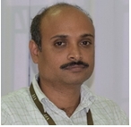

K N M Rao is Associate Professor in [CDMM](http://info.vit.ac.in/cdmm/index.html) at VIT University - Vellore; research is mainly focused on design and simulation of industrial plants using Aspen.

K N M Rao received a BTech in chemical Engineering in 2001, from JNTUH, and the PhD in Chemical Engineering in 2011, from Andhra University.

Site is under construction ...... 

---

<h4>contact</h4>

    

        

            K N M Rao 
            <a href="http://info.vit.ac.in/cdmm/index.html"> Center for Disaster Mitigation and Management </a> 
            <a href="http://www.vit.ac.in/">Vellore Institute of Technology;Vellore</a> 
            
            

            Email: <code>bro</code><b>I</b><code>man</code><b>don't</b><code>@</code><b>want</b><code></code><b>spam!
            </b><code></code><b>So</b><code></code><b>please</b><code>wi</code><b>leave
            </b><code>sc</code><b>me</b><code>.</code><b>alone</b><code>e</code><b>!</b><code>du</code> 
            Phone: 0416-2202160
            

        

        

        
        

    

